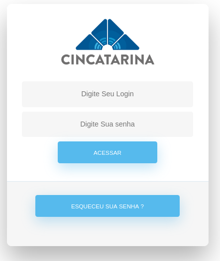

# Sistema Único do CINCATARINA

# Gestão e controle de energia

 Sistema Desenvolvido em JavaScript, utilizando o framework Angular 8, bootstrap, API PHP para comunicação com banco em MySQL.

 

### Framework

* Angular
* Bootstrap

### API's 

* PHP --> MySQL 

### Banco de Dados 

* MySQL

### Documentação Completa

* GitBook (<https://leovenancio00.gitbook.io/projeto-controle-de-energia/>)


### Linguagens Utilizadas

* JavaScipt

## Requisitos

É fundamental a utilização de alguma ferramenta para rodar o servidor localmente, como o:

* XAMPP
* LAMPP
* WAMP SERVER


## Instalação
Deve-se instalar pelo terminal o comando para Instalação do Angular:

```sh
npm install -g @angular/cli
``` 


## Desenvolvedores do Projeto:

1. Leonardo Teixeira
